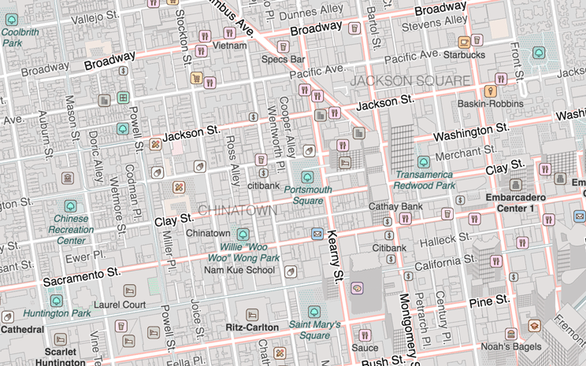

# sf building heights preview

[san francisco building height import](http://wiki.openstreetmap.org/wiki/San_Francisco_Building_Height_Import) on the osm wiki - go write your name down if you are interested in this

this is using [@bdon](http://bdon.org/)'s [vector tiles](http://s3-us-west-2.amazonaws.com/openmassing.org/index.html) from that LIDAR dataset

rendered with [tangram](mapzen.com/projects/tangram) and the [bubble wrap](https://mapzen.com/blog/bubble-wrap-carto/) style

i just mashed some things up together so you can compare the LIDAR heights with heights currently in OSM - [preview here](http://louh.github.io/sf-building-heights-preview)
